```{=html}
<link href="https://cdn.jsdelivr.net/npm/bootstrap@5.3.0/dist/css/bootstrap.min.css" rel="stylesheet">
<script src="https://cdn.jsdelivr.net/npm/bootstrap@5.3.0/dist/js/bootstrap.bundle.min.js"></script>
```
:::{.center-page-vertically}
::: {.row .my-4}

:::: {.col-8}

The present work is the result of a team work involving

- Thomas Bellotti (CNRS, EM2C - Fédé Maths CS)
- Loïc Gouarin (École polytechnique, CMAP)
- Josselin Massot (École polytechnique, CMAP)
- Pierre Matalon (École polytechnique, CMAP)
- Laurent Séries (École polytechnique, CMAP)
- Christian Tenaud (CNRS, EM2C - Fédé Maths CS)

::::

:::: {.col .text-center .align-self-center}

:::{.text-center .mb-4}
[website of the team](https://initiative-hpc-maths.gitlab.labos.polytechnique.fr/site/)

[https://github.com/hpc-maths/](https://github.com/hpc-maths/)
:::
{width=40%}
::::
:::

::::


# Mesh adaptation and error control

##  Burgers equation - sinus problem


$$
\partial_t u + \partial_x \left ( f(u) \right ) = 0, \quad t \geq 0, \quad x \in \mathbb{R}, \qquad f(u) = \dfrac{u^2}{2},
$$


Consider the Cauchy problem with initial conditions:


$$
u^0(x) = \frac{1}{2} (1+\sin(\pi(x-1))) \quad x \in [-1,1]
$$



---

##  Adaptive Multiresolution


::: {.row}

:::: {.col-7}

- Minimum level $\underline{\ell}$ and maximum level $\bar{\ell}$.
- Cells:
$$
C_{\ell, k}:=\prod_{\alpha=1}^d\left[2^{-\ell} k_\alpha, 2^{-\ell}\left(k_\alpha+1\right)\right]
$$
- Finest step: $\Delta x=2^{-\bar{\ell}}$.
- Level-wise step: $\Delta x_{\ell}:=2^{-\ell}=2^{\Delta \ell} \Delta x$.
::::

:::: {.col}
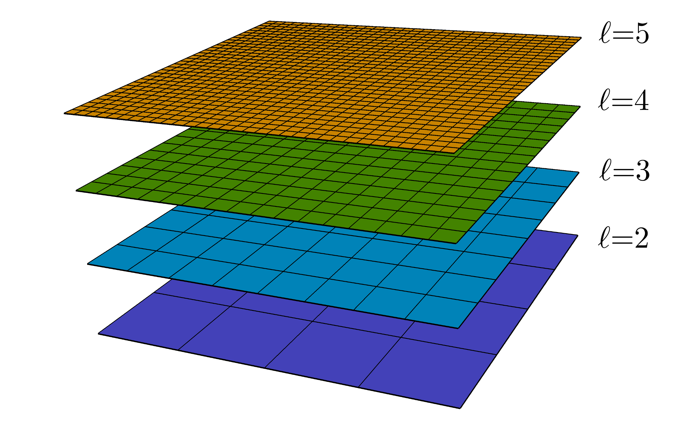
::::
:::


---

## Wavelets

Decomposition of the solution on a wavelet basis [Daubechies, '88], [Mallat, '89] to measure its local regularity.
"Practical" approach by [Harten, '95], [Cohen et al., '03].

::: {.row .mt-4}

:::: {.col-6}

**Projection operator**

**Prediction operator** at order $2 s +1$

$$
{\hat f}_{\ell+1,2 k}={f}_{\ell, k}+\sum_{\sigma=1}^s \psi_\sigma\left({f}_{\ell, k+\sigma}-{f}_{\ell, k-\sigma}\right)
$$

::::: {style="text-align: left"}
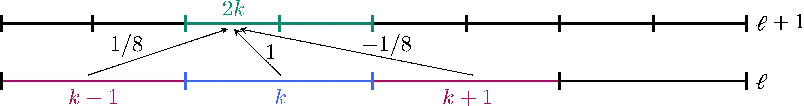
:::::
::::
:::: {.col-6 .fragment}

Details are **regularity indicator**
$$
{\mathrm{d}}_{\ell, {k}}:={f}_{\ell, {k}}-{\hat{f}}_{\ell, {k}}
$$


Let $f \in W^{\nu, \infty}$ (neigh. of $C_{\ell, k}$ ), then
$$
\left|{\mathrm{d}}_{\ell, k}\right| \lesssim 2^{-\ell \min (\nu, 2 s +1)}|f|_{W^{\min (\nu, 2 s +1), \infty}}
$$

::::
:::
::: {.text-center .mt-4 .fragment}

**Fast wavelet transform:**

means at the finest level can be recast as means at the coarsest level + details
$$
\begin{array}{rlr}
{f}_{\overline{\ell}}
& \Longleftrightarrow & \left({f}_{\underline{\ell}}, {{d}}_{\underline{\ell} +1}, \ldots, {d}_{\bar{\ell}}\right)\\
\end{array}
$$

:::

---

## Mesh coarsening (static)

Local regularity of the solution allows to select areas to coarsen

$$
{{f}}_{\bar{\ell}} \rightarrow \left({f}_{\underline{\ell}}, {\mathbf{d}}_{\underline{\ell}+1}, \ldots, {\mathbf{d}}_{\bar{\ell}}\right)  \rightarrow \left({f}_{\underline{\ell}}, {\tilde{\mathbf{d}}}_{\underline{\ell}+1}, \ldots, \tilde{{\mathbf{d}}}_{\bar{\ell}}\right) \rightarrow  {\tilde{{f}}}_{\bar{\ell}}
$$
$$
 \tilde{{\mathrm{d}}}_{\ell, k}=
 \begin{cases}0, & \text { if } \left|{\mathbf{d}}_{\ell, k}\right| \leq \epsilon_{\ell}=2^{-d \Delta \ell} \epsilon, \quad \rightarrow \quad\left\|{\mathbf{f}}_{\bar{\ell}}-\tilde{{\mathbf{f}}}_{\bar{\ell}}\right\|_{\ell^p} \lesssim \epsilon \\
{\mathrm{d}}_{\ell, k}, & \text { otherwise}
\end{cases}
$$

Set a small (below $\epsilon_{\ell}$) detail to zero $\equiv$  erase the cell $C_{\ell, k}$ from the structure

---

## Examples

::::{.row}

:::::{.col}
:::{.callout-tip title="Equation" icon=false}
$$
f(x) = 1 - \sqrt{\left| sin \left( \frac{\pi}{2} x \right) \right|} \; \text{for} \; x\in[-1, 1]
$$
:::
::::

:::::{.col}

<table>
    <tr>
        <td>min level</td>
        <td>1</td>
    </tr>
    <tr>
        <td>max level</td>
        <td>12</td>
    </tr>
    <tr>
        <td>&#949;</td>
        <td>10<sup>-3</sup></td>
    </tr>
    <tr>
        <td>compression rate</td>
        <td>96.29%</td>
    </tr>
    <tr>
        <td>error</td>
        <td>0.00053</td>
    </tr>
</table>
::::

:::::

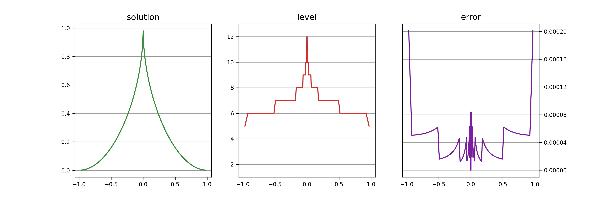{fig-align=center}

## Time evolution of PDEs

- Finite volumes with global time step $\Delta t = \Lambda(\Delta x)$
- Use dynamic mesh refinement


Mesh updated using “old” information at time $t$ to accommodate the one at time
$t + \Delta t$


- Propagation of information :  add security cells
- Formation of singularities : (regularity index: $\nu =0$, $\mu = \min(\nu,2 s +1)$) refine if
$$
\left|{\mathbf{d}}_{\ell, k}\right| \geq \epsilon_{\ell}\,2^{d+\mu}
$$

::: {.text-center}
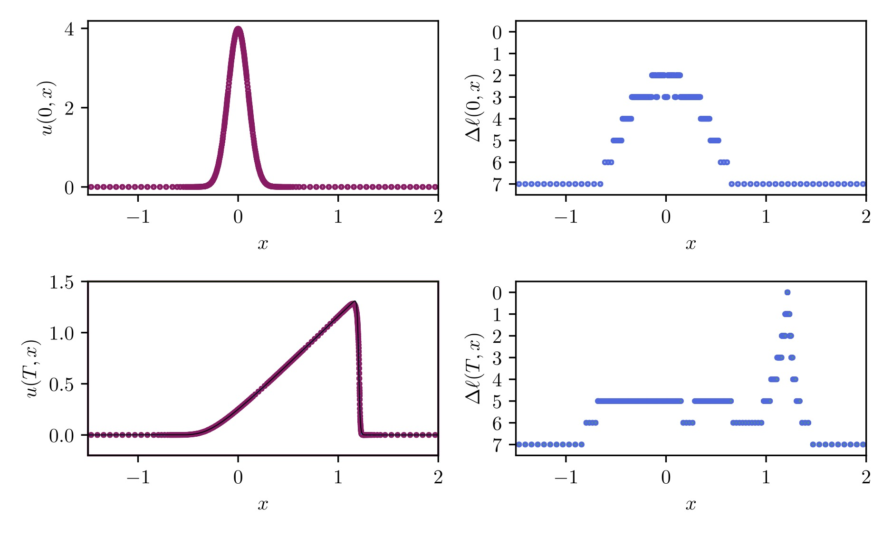{width=50%}
:::


---

## Finite volumes / conservation / order


:::{.mb-3}
Flux evaluation at interfaces between levels
:::


:::: {.fragment}

:::{.my-3}
Using the prediction operator allows to evaluate fluxes at the same level
:::


::::

:::{.callout-note .mt-3 icon=false title="Finite volume method"}
We use a Godunov flux for the small hat problem
:::


---



# Numerical Analysis and Modified Equations

## Linear scalar transport equation
In this work, we are concerned with the numerical solution of the Cauchy problem associated with the linear scalar conservation law

$$
\partial_t u(t, x)+V \partial_x u(t, x)=0, \quad(t, x) \in \mathbb{R}^{+} \times \mathbb{R}
$$

where $V$ is the transport velocity, taken $V>0$ without loss of generality.
we consider 1 d problems. The extension to $2\mathrm{~d}$ / $3\mathrm{~d}$ problems is straightforward and usually done by tensorization [Bellotti2022] and yields analogous conclusions.

The discrete volumes are
$$
C_{\ell, k}:=\left[2^{-\ell} k, 2^{-\ell}(k+1)\right], \quad k \in \{ 0,2^{\ell}-1 \},
$$
for any $\ell \in \{ \underline{\ell}, \bar{\ell} \}$. The measure of each cell at level $\ell$ is $\Delta x_{\ell}:=2^{-\ell}$ and we shall indicate $\Delta x:=\Delta x_{\bar{\ell}}$. The cell centers are $x_{\ell, k}:=$ $2^{-\ell}(k+1 / 2)$. Finally, we shall indicate $\Delta \ell:=\bar{\ell}-\ell$, hence $\Delta x_{\ell}=2^{\Delta \ell} \Delta x$.


## Finite Volume scheme

Finite Volume scheme at the finest level of resolution $\bar{\ell}$ for any cell of indices $\bar{k} \in \{ 0,2^{\bar{\ell}}-1 \}$. Explicit schemes read:

$$
\mathrm{v}_{\bar{\ell}, \bar{k}}^{n+1}=\mathrm{v}_{\bar{\ell}, \bar{k}}^n-\frac{\Delta t}{\Delta x}\left(\Phi\left(\mathrm{v}_{\bar{\ell}, \bar{k}+1 / 2}^n\right)-\Phi\left(\mathrm{v}_{\bar{\ell}, \bar{k}-1 / 2}^n\right)\right)
$$

where we utilize the same linear numerical flux for the left and the right flux (conservativity)
$$
\Phi\left(\mathbf{v}_{\bar{\ell}, \bar{k}-1 / 2}\right):=V \sum_{\alpha=\underline{\alpha}}^{\bar{\alpha}} \phi_\alpha \mathbf{v}_{\bar{\ell}, \bar{k}+\alpha}, \quad \Phi\left(\mathbf{v}_{\bar{\ell}, \bar{k}+1 / 2}\right):=V \sum_{\alpha=\underline{\alpha}}^{\bar{\alpha}} \phi_\alpha v_{\bar{\ell}, \bar{k}+1+\alpha}
$$

## Modified equations

[Carpentier et al 97] or Cauchy-Kowalewski procedure [Harten et al 87]

$$
\partial_t u\left(t^n, x_{\bar{\ell}, \bar{k}}\right)+V \partial_x u\left(t^n, x_{\bar{\ell}, \bar{k}}\right)=\sum_{h=2}^{+\infty} \Delta x^{h-1} \sigma_h \partial_x^h u\left(t^n, x_{\bar{\ell}, \bar{k}}\right)
$$

::: {.incremental}
- Upwind scheme
$$
\partial_t u+V \partial_x u=\frac{\Delta x V}{2}(1-\lambda V) \partial_{x x} u+O\left(\Delta x^2\right)
$$
- Lax-Wendroff scheme
$$
\partial_t u+V \partial_x u=-\frac{\Delta x^2 V}{6}\left(1-\lambda^2 V^2\right) \partial_x^3 u+O\left(\Delta x^3\right)
$$
- OSMP-3 scheme
$$
\partial_t u+V \partial_x u=\frac{\Delta x^3 V}{24}\left(-\lambda^3 V^2+2 \lambda^2 V^2+\lambda V-2\right) \partial_x^4 u+O\left(\Delta x^4\right)
$$
:::

## How to include MRA I


We introduce the reconstruction operator $\hat{s}$ instead of $s$ on the cells $\left(\bar{\ell}, 2^{\Delta \ell} k+\delta\right)$ for any $\delta \in \mathbb{Z}$ at the finest level

- $\hat{s}=s$ : exact local flux reconstruction [Cohen et al. 2003].
- $\hat{s}=0$ but $s>0$, direct evaluation or naive evaluation [Hovhannisyan et al 2010].


:::: {.fragment}

$$
\mathbf{w}_{\bar{\ell}, \bar{k}}^{n+1}=\mathbf{w}_{\bar{\ell}, \bar{k}}^n-\frac{\Delta t}{\Delta x}\left(\Phi\left(\hat{\hat{\mathbf{w}}}_{\bar{\ell}, \bar{k}+1 / 2}^n\right)-\Phi\left(\hat{\hat{\mathbf{w}}}_{\bar{\ell}, \bar{k}-1 / 2}^n\right)\right)
$$
$$
\Phi\left(\hat{\hat{\mathbf{w}}}_{\bar{\ell}, \bar{k}-1 / 2}\right):=V \sum_{\alpha=\underline{\alpha}}^{\bar{\alpha}} \phi_\alpha \hat{\hat{\mathbf{w}}}_{\bar{\ell}, \bar{k}+\alpha}
$$

::::

## How to include MRA II

Let now $(\ell, k) \in S\left(\tilde{\Lambda}^{n+1}\right)$, taking the projection yields the multiresolution scheme

$$
\mathbf{w}_{\ell, k}^{n+1}=\mathbf{w}_{\ell, k}^n-\frac{\Delta t}{\Delta x_{\ell}}\left(\Phi\left(\hat{\hat{\mathbf{w}}}_{\bar{\ell}, 2^{\Delta \ell}(k+1)+1 / 2}^n\right)-\Phi\left(\hat{\hat{\mathbf{w}}}_{\bar{\ell}, 2^{\Delta \ell} k-1 / 2}^n\right)\right)
$$

$$
\Phi\left(\hat{\hat{\mathbf{w}}}_{\bar{\ell}, 2^{\Delta \ell} k-1 / 2}\right):=V \sum_{\alpha=\underline{\alpha}}^{\bar{\alpha}} \phi_\alpha \hat{\hat{\mathbf{w}}}_{\bar{\ell}, 2^{\Delta \ell} k+\alpha}
$$

:::{.my-4}
Some information is loss because of the averaging procedure: two different schemes we can consider for the computation of the modified equations.
:::

:::{.callout-important icon=false title="Theorem"}
The local truncation error of the reference Finite Volume scheme and the one of the adaptive Finite Volume scheme are the same up to order $2\hat{s}+1$ included.
:::


## Modified equations including MRA


This result establishes at which order the modified equations of the reference scheme are perturbed by the introduction of the adaptive scheme. However, it does not characterize the terms in the modified equations above order $2\hat{s}+1$ in $\Delta x$ (symbolic computations).


::: {.incremental}
- Upwind scheme (original)
$$
{\color{blue}{%
\partial_t u+V \partial_x u=\frac{\Delta x V}{2}(1-\lambda V) \partial_{x x} u+O\left(\Delta x^2\right)
}}
$$
- Upwind scheme with MRA
$$
\begin{array}{lr}
\partial_t u+V \partial_x u=\frac{\Delta x V}{2}\left(2^{\Delta \ell}-\lambda V\right) \partial_{x x} u+O\left(\Delta x^2\right), & \text { for } \hat{s}=0 \\
\partial_t u+V \partial_x u=\frac{\Delta x V}{2}(1-\lambda V) \partial_{x x} u-\frac{\Delta x^2 V}{6}\left(1-\lambda^2 V^2\right) \partial_x^3 u+& \\
\ \ \ \ \ \ \ \ \ \ \frac{\Delta x^3 V}{24}\left(-3 \Delta \ell 2^{2 \Delta \ell}+2^{2 \Delta \ell}-\lambda^3 V^3\right) \partial_x^4 u+O\left(\Delta x^4\right), & \text { for } \hat{s}=1
\end{array}
$$
:::


## Modified equations including MRA


This result establishes at which order the modified equations of the reference scheme are perturbed by the introduction of the adaptive scheme. However, it does not characterize the terms in the modified equations above order $2\hat{s}+1$ in $\Delta x$ (symbolic computations).


::: {.incremental}
- Lax-Wendroff scheme (original)
$$
{\color{blue}{\partial_t u+V \partial_x u=-\frac{\Delta x^2 V}{6}\left(1-\lambda^2 V^2\right) \partial_x^3 u+O\left(\Delta x^3\right)}}
$$
- Lax-Wendroff scheme with MRA
$$
\begin{array}{lr}
\partial_t u+V \partial_x u=\frac{\Delta x \lambda V^2}{2}\left(2^{\Delta \ell}-1\right) \partial_{x x} u+O\left(\Delta x^2\right), &  \text { for } \hat{s}=0 \\
\partial_t u+V \partial_x u=-\frac{\Delta x^2 V}{6}\left(1-\lambda^2 V^2\right) \partial_x^3 u+&\\
\ \ \ \ \ \ \ \ \ \ \frac{\Delta x^3 \lambda V^2}{24}\left(-3 \Delta \ell 2^{2 \Delta \ell}+2^{2 \Delta \ell}-\lambda^2 V^2\right) \partial_x^4 u+O\left(\Delta x^4\right), & \text { for }  \hat{s}=1
\end{array}
$$

:::


## Theoretical results on the global error

:::{.callout-important icon=false title="Theorem 2"}
Assume that

- The reference scheme satisfies the restricted stability condition $\|E\| \leq 1$
- The Harten-like scheme satisfies the restricted stability condition $\left\|\bar{E}_{\Lambda}\right\| \leq 1$ for any $\Lambda$.

Then, for smooth solution, in the limit $\Delta x \rightarrow 0$ (i.e. $\bar{\ell} \rightarrow+\infty$ ) and for $\Delta \underline{\ell}=\bar{\ell}-\underline{\ell}$ kept fixed, we have the error estimate

$$
\left\|\mathbf{v}_{\bar{\ell}}^n-\mathbf{w}_{\bar{\ell}}^n\right\| \leq C_{t r} t^n \Delta x^{2 \hat{s}+1}+C_{m r} \frac{t^n}{\lambda \Delta x} \epsilon
$$

where $C_{t r}=C_{t r}\left(\bar{\ell}-\underline{\ell},\left(\phi_\alpha\right)_\alpha, \lambda, \hat{s}, V\right)$ and $C_{m r}=C_{m r}\left(\bar{\ell}-\underline{\ell},\left(\phi_\alpha\right)_\alpha, \lambda, \hat{s}, s, V\right)$.
$$
\left\|\mathbf{u}_{\bar{\ell}}^n-\mathbf{w}_{\bar{\ell}}^n\right\| \leq C_{r e f} t^n \Delta x^\theta+C_{t r} t^n \Delta x^{2 \hat{s}+1}+C_{m r} \frac{t^n}{\lambda \Delta x} \epsilon
$$
:::


## Comments on theorem

::: {.incremental}
* The error estimate contains three contributions: the **discretization error** of the reference scheme, the **perturbation error** between the reference and the adaptive scheme, and the **thresholding error** coming from the multiresolution
* The constant $C_{\mathrm{tr}}$ generally grows exponentially with $\bar{\ell}-\underline{\ell}$, sometimes also involving linear terms, i.e. $\hat{s}=1$. We have the following cases:
    + $\theta<2 \hat{s}+1$. The error of the reference scheme dominates the perturbation introduced by the adaptive scheme $\left\|\mathbf{u}_{\bar{\ell}}^N-\mathbf{w}_{\bar{\ell}}^N\right\| \leq C_{\mathrm{ref}} T \Delta x^\theta+C_{\mathrm{mr}} \frac{T}{\lambda \Delta x} \epsilon$. A thresholding error of the same order as the reference error $\epsilon \sim \Delta x^{\theta+1}$.
    + $\theta=2 \hat{s}+1$.  The error of the reference scheme and the perturbation order are comparable (**first example!**) We have $\left\|\mathbf{u}_{\bar{\ell}}^N-\mathbf{w}_{\bar{\ell}}^N\right\| \leq\left(C_{\mathrm{ref}}+C_{\mathrm{tr}}\right) T \Delta x^\theta+C_{\mathrm{mr}} \frac{T}{\lambda \Delta x} \epsilon$.
    +  $\theta>2 \hat{s}+1$. The perturbation introduced by the adaptive scheme dominates the error of the reference scheme. Therefore, multiresolution introduces a large perturbation that yields a different convergence rate. We have $\left\|\mathbf{u}_{\bar{\ell}}^N-\mathbf{w}_{\bar{\ell}}^N\right\| \leq C_{\mathrm{tr}} T \Delta x^{2 \hat{s}+1}+C_{\mathrm{mr}} \frac{T}{\lambda \Delta x} \epsilon$, thus $\epsilon \sim \Delta x^{2 \hat{s}+2}$ (**AMR !**)
:::


:::{.notes}
Assume that for the choice of $\bar{\ell}-\underline{\ell}$ at hand, we have $C_{\mathrm{tr}} \sim C_{\mathrm{ref}}$, then w
:::


## How to compute fluxes at the finest level

:::{.text-center}
<video data-autoplay src="videos/portions/portion_0000_autocreated.mp4" />
:::

:::{.notes}
As we have seen, calculating the flux at the finest level is crucial to obtaining good error estimates. But how does this work in practice?

Let's take a simple example.
:::

## How to compute fluxes at the finest level

:::{.text-center}
<video data-autoplay src="videos/portions/portion_0001_unnamed.mp4" />
:::

:::{.notes}
Let's imagine that our finest level is 4 levels away from where we are.
:::

## How to compute fluxes at the finest level

:::{.text-center}
<video data-autoplay src="videos/portions/portion_0002_unnamed.mp4" />
:::

:::{.notes}
Now let's imagine that we want to calculate the flow using this small cell on the left.
We use an operator with s = 1, so we need 3 cells on the level below to calculate it. These 3 cells need 4 cells on the level below to be calculated. We can repeat the process indefinitely and we'll still need 4 cells on the bottom level.

We can determine the coefficients of our linear application to go from our level to any cell on a higher level. There's no need for an intermediate level.
:::

## How to compute fluxes at the finest level

:::{.text-center}
<video data-autoplay src="videos/portions/portion_0003_unnamed.mp4" />
:::

:::{.notes}
We can do the same for the right-hand cell.
We can see that the cells used are not exactly the same.

Now, if we wanted to reconstruct all the cells of the finest level, we'd only need these 5 cells, with different coefficients depending on the cell we're trying to reconstruct.
:::


# Burgers results

---

## Burgers results (Error for scheme order 1)



---

## Burgers results (Error for scheme order 1)



---

## Burgers results (Error for scheme order 1)



---


## Burgers results (MR solution and level for scheme order 1)



---

## Burgers results (MR solution and error for scheme order 1)



---

## Burgers results (MR+MLF sol. and level for scheme order 1)



---

## Burgers results (MR+MLF sol. and error for scheme order 1)



---

## Burgers results (Error for scheme order 1)



---

## Burgers results (MR solution and level for scheme order 1)



---

## Burgers results (MR solution and error for scheme order 1)



---

## Burgers results (MR+MLF sol. and level for scheme order 1)



---

## Burgers results (MR+MLF sol. and error for scheme order 1)




---

## Burgers results (Error for scheme order 3)



---


## Burgers results (Error for scheme order 3)



---

## Burgers results (MR solution and level for scheme order 3)



---

## Burgers results (MR solution and error for scheme order 3)



---

## Burgers results (MR+MLF sol. and level for scheme order 3)



---

## Burgers results (MR+MLF sol. and error for scheme order 3)



---


## Burgers results (MR VS MR+MLF error for scheme order 3)




---


## Burgers 2D results (MR+MLF solution order 1)


::::{.center-page-vertically}
:::{.text-center}
<video data-autoplay width="99%" src="videos/burgers2d.mp4" />
:::
::::


---

## Euler 2D results (MR+MLF solution order 3 (OSMP scheme))


<!-- :::{.text-center}
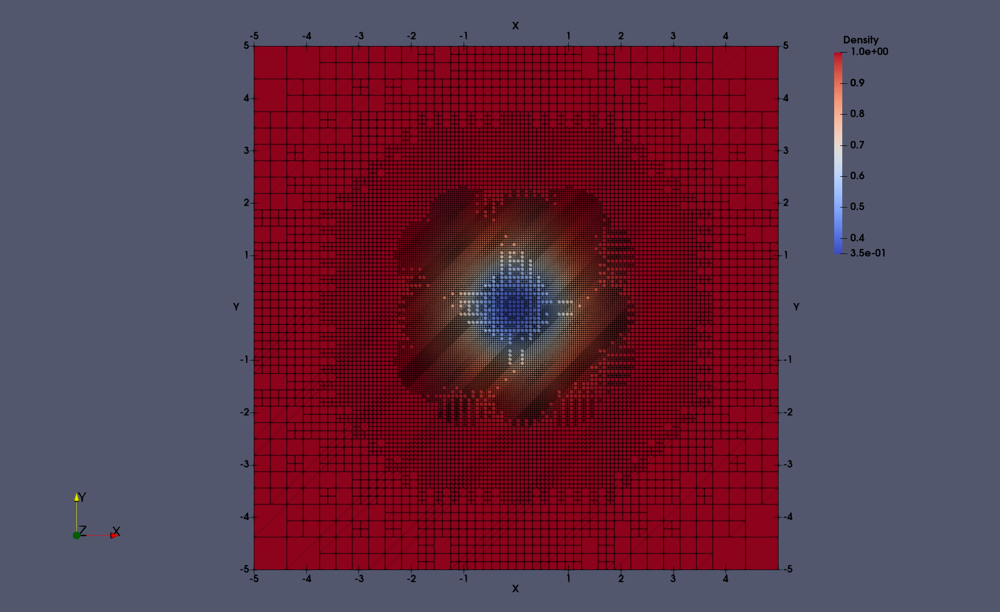{width=47%}
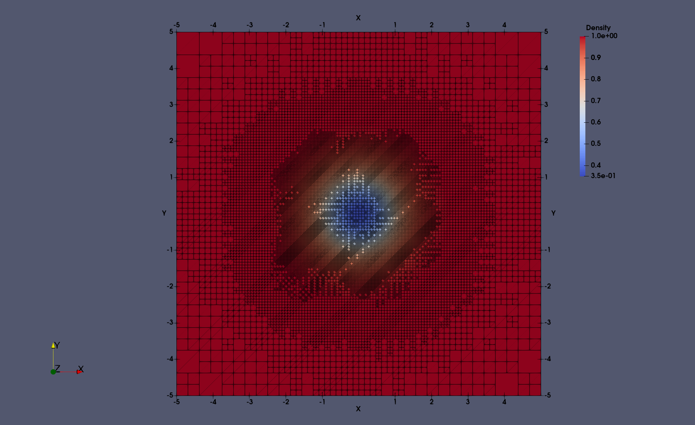{width=47%}
::: -->

::: {layout-nrow=2}
{width=47%}
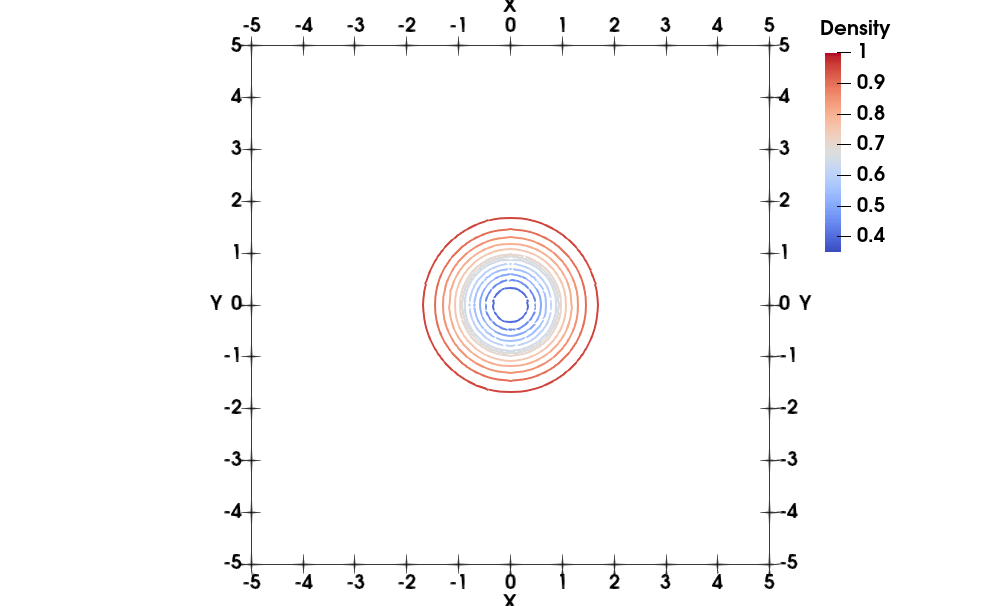{width=47%}
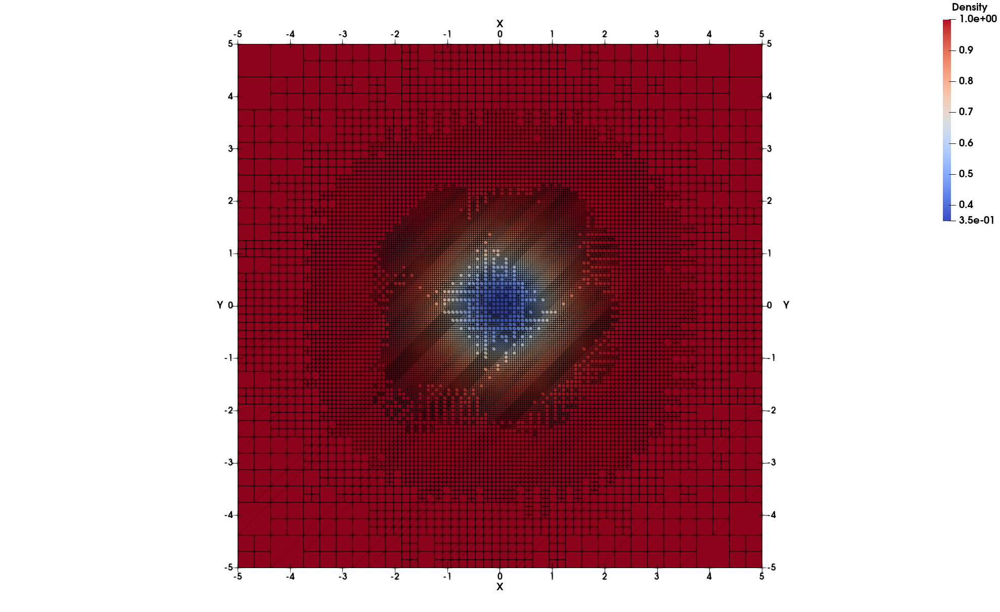{width=47%}
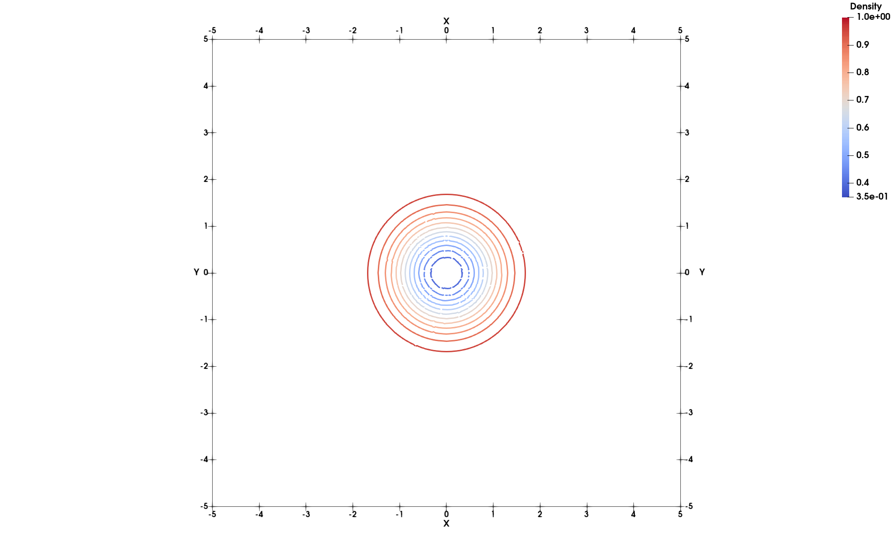{width=47%}

<!-- {width=47%}
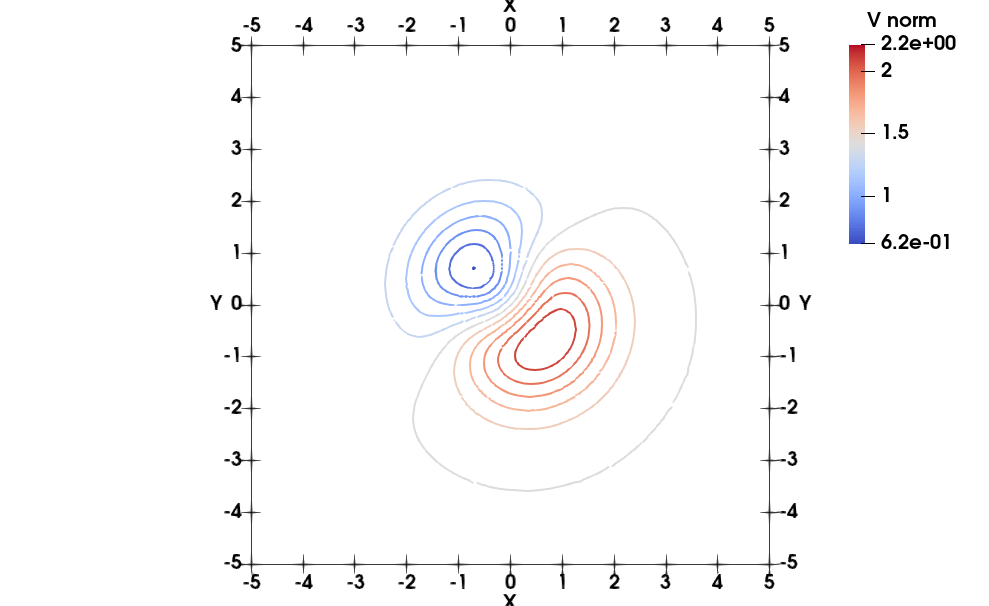{width=47%}
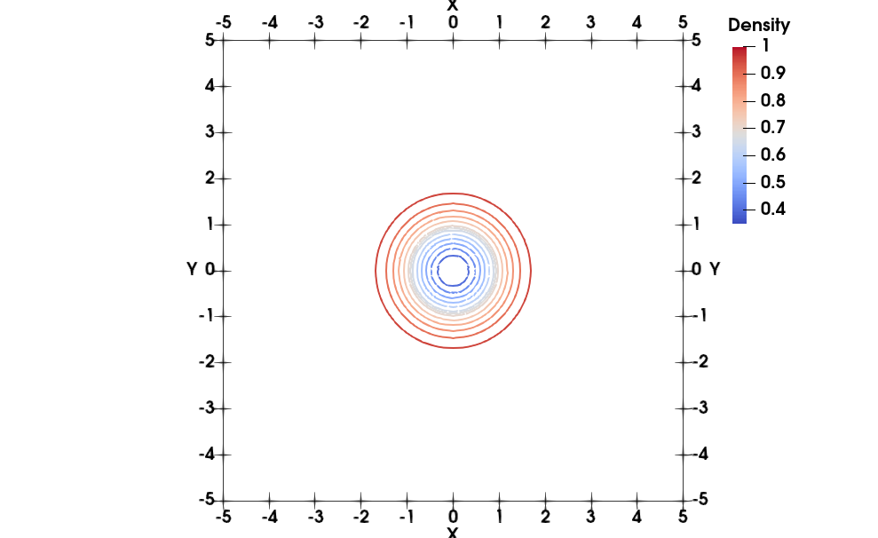{width=47%}
{width=47%} -->
:::

---

## Euler 2D results (MR+MLF solution order 3 (OSMP scheme))


<!-- :::{.text-center}
{width=47%}
{width=47%}
::: -->

::: {layout-nrow=2}
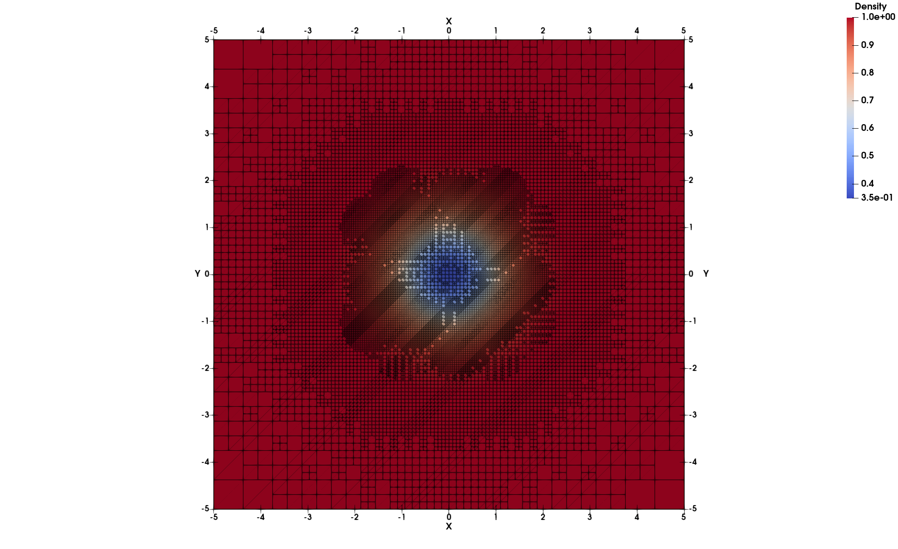{width=47%}
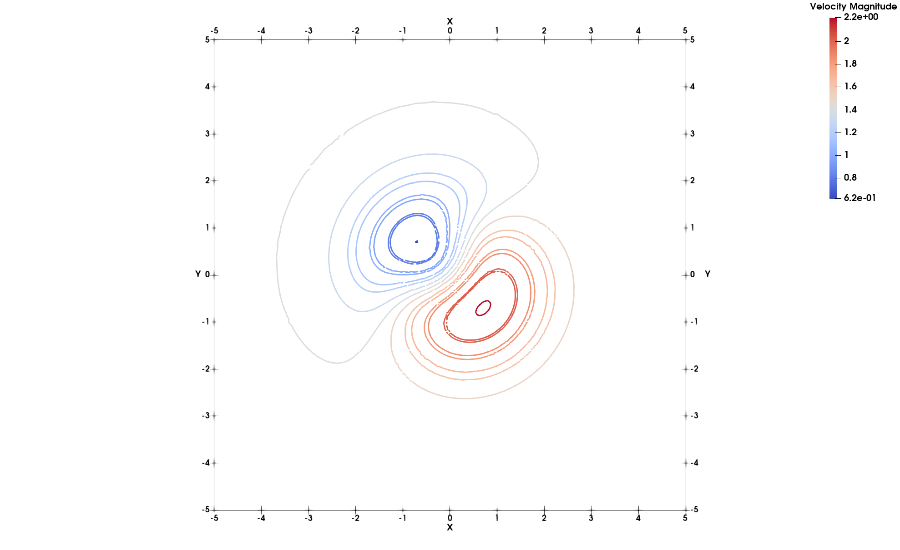{width=47%}
{width=47%}
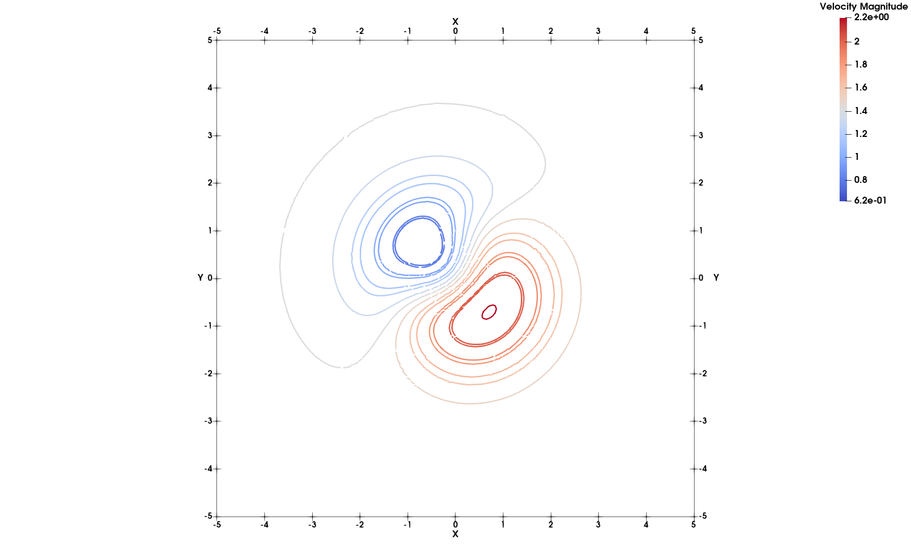{width=47%}
:::

---

:::::{.center-page}
:::{.row .align-items-center}
::::{.col-10}
<video data-autoplay loop="true" src="videos/Temperature_ShockDDT_H2Air_Stoichio_T325K8_P1atm_t430_700.m4v" />
::::
::::{.col}
::: {layout-nrow=3, layout="[[30],[5],[30],[5],[30]]"}


{height="80px"}
:::
::::
:::

:::::

---

## Conclusion {.fs-4}

::::{.align-self-center}
- Analysis of mesh adaptation completed for convection - extension to reaction and diffusion
  - Link with AMR important in terms of accuracy of the simulations
- Conducting simulation with strict error control requires adpative multiresolution
  - Data structure is a key issue - see presentation of **L. Gouarin**
  - New generation of coupled splitting / ImEx schemes in samurai
- Link through the code and developper team to various applications
::::

<div style="position: absolute; top: 50%; transform: translate(0, 10%); text-align: center;">

:::{.row}
::::{.col-4 .align-self-center}

::::
::::{.col .align-self-center}
<h4>samurai</h4>
::::
:::
</div>

## Patched-based representation


::::{.center-page-vertically-2 .lh-lg}
:::{.row}
::::{.col}
:::::{.callout-tip icon=false title="Advantages"}
- compact data structure
- rectangular zones work well for tiling and optimizing caches
- efficient to work with neighbors and the different levels
:::::
:::::{.callout-important  icon=false title="Disadvantages"}
- requires more cells than necessary
  - grid hierarchy: overlapping
  - larger refinement zone
:::::

::::
::::{.col-4 .align-self-center}
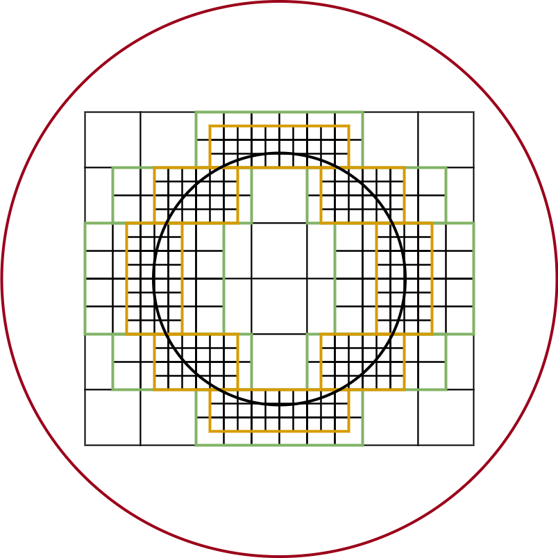
::::
:::
::::
## Cell-based representation

::::{.center-page-vertically-2 .lh-lg}
:::{.row}
::::{.col}
:::::{.callout-tip icon=false title="Advantages"}
- no grids hierarchy
- keep only needed cells
:::::
:::::{.callout-important  icon=false title="Disadvantages"}
- more difficult to find the neighbors
- more difficult to work with the different levels
- tree-like structure
- more difficult to add ghost cells hierarchy
:::::

::::
::::{.col-4 .align-self-center}
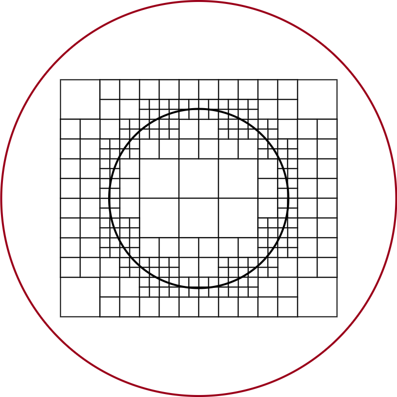
::::
:::
::::

:::{.notes}
If we look at all the open source software specializing in dynamic mesh adaptation, there are two main families:
- patch-based, which is a hierarchical representation of the mesh: layers are placed on top of layers
- cell-based, which is a flat representation of the mesh

Each has its advantages and disadvantages:
- patch-based has rectangular zones for tiling and optimizing caches. But it generally requires more cells than necessary.
- cell-based requires far fewer cells but requires a tree-like structure, which means that you lose the good memory locality you had with patch-based. We use space filling curves such as Morton or Hilbert to find an acceptable locality.
:::

## Adaptive methods

::::::{.center-page-vertically-2 .lh-lg}
:::{.row}
::::{.col}

:::{.h3}
AMR
:::

:::::{.callout-tip icon=false title="Advantages"}
- based on heuristic criteria (gradient, second derivative, ...)
- easy to implement
:::::
:::::{.callout-important  icon=false title="Disadvantages"}
- physical problem understanding is important
- add potentially more cells that needed
:::::
::::
::::{.col}

:::{.h3}
MRA <span class="fs-5">(see the presentation of <strong>M. Massot</strong>)</span>
:::

:::::{.callout-tip icon=false title="Advantages"}
- based on wavelet decomposition
- error control
- independent of the physical problem
- only needed cells
:::::
:::::{.callout-important  icon=false title="Disadvantages"}
- difficult to implement with the current data structures
- can be costly
:::::
::::
:::
::::::


---

:::{.center-page .h1}
Can we have a data structure that takes the advantages of both and well suited to implement various adaptive mesh refinement methods ?
:::

<!-- ## Open source software

:::::{.center-page}

::: {.fs-5}
| Name    | Data structure | Adaptation criteria | Time scheme                     | Load balancing               |
|---------|----------------|---------------------|---------------------------------|------------------------------|
| AMReX   | block          | heuristic           | global/local                    | SFC                          |
| Dendro  | tree           | wavelet             | global                          | SFC                          |
| Dyablo  | tree           | heuristic           | global                          | SFC                          |
| Peano   | tree           | -                   | -                               | SFC                          |
| P4est   | tree           | -                   | -                               | SFC                          |
| samurai | interval       | heuristic/wavelet   | RK/splitting/IMEX<br>time-space/code coupling               | SFC/diffusion algorithm      |
:::

::: {.text-center .color .mt-5 .fragment}
*samurai: create a unified framework for testing a whole range<br class='m-0'>of mesh adaptation methods with the latest generation of numerical schemes.*
:::
:::::

:::{.notes}
Here's an overview of the software we think is interesting to look at today.

Peano and p4est don't have any adaptation or time-scheme criteria, as they are software programs specializing solely in mesh management.
::: -->
---

:::{.center-page}
::::{.row}
:::::{.col-6}

::::::
::::::{.col-6 .align-self-center .text-end}
:::{.h1 .title-talk}
Samurai
:::
::::::
::::
:::

## Design principles

:::{.center-page-vertically .lh-lg}
- Compress the mesh according to the level-wise spatial connectivity along each Cartesian axis.
- Achieve fast look-up for a cell into the structure, especially for parents and neighbors.
- Maximize the memory contiguity of the stored data to enable caching and vectorization.
- Manage and facilitate complex operations between meshes (numerical schemes, MRA, ...).
:::

## An overview of the data structure

::: {.row}

:::: {.col-5}
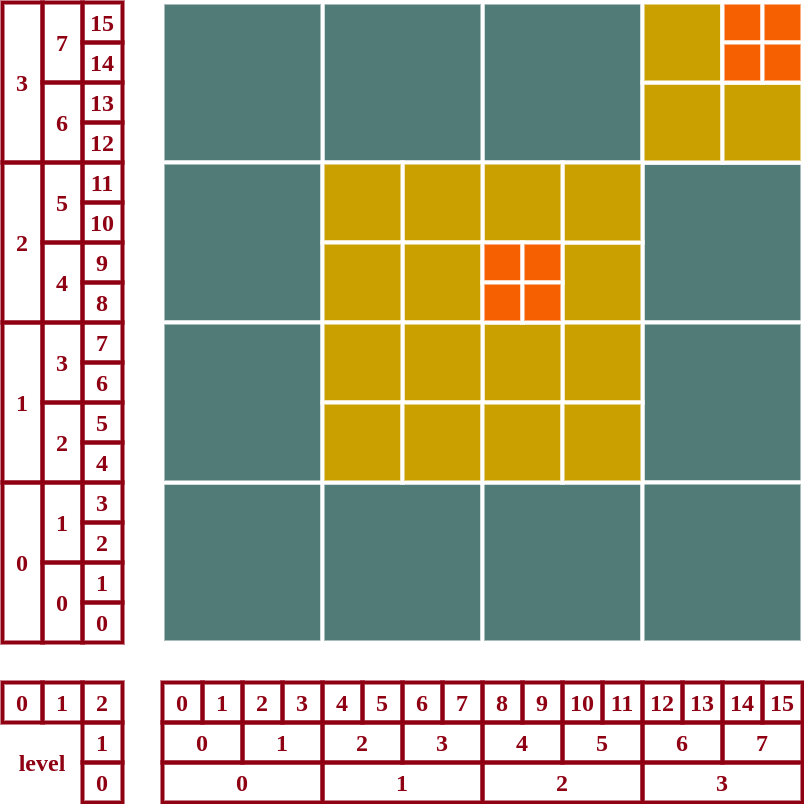
::::

:::: {.col .text-center .align-self-center}
<span class="interval_symb">[</span>
<span class="interval_bound">start</span>
<span class="interval_symb">,</span>
<span class="interval_bound">end</span>
<span class="interval_symb">[ @ </span>
<span class="interval_offset">offset</span>
::::

:::

:::{.notes}
We illustrate the samurai data structure, starting with a 2D problem to see all the components. The data structure is fully recursive and can therefore handle Nd Cartesian meshes.

The main element of samurai is an interval modeled by its beginning and non-included end. There's also an offset parameter that will serve us in two different ways. We'll come back to this later.
:::

## An overview of the data structure

::: {.row}

:::: {.col-4}
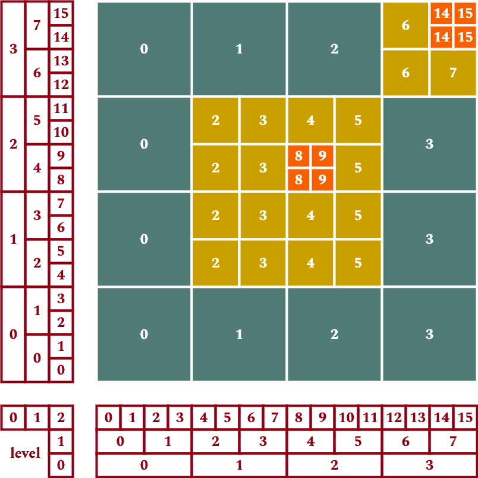
::::

:::: {.col-2 .fragment data-fragment-index="1"}
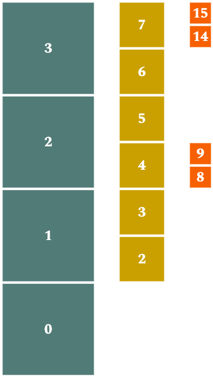{height="254px"}
::::

```{=html}

```
:::

:::{.notes}
The first thing we're going to do is go through each level and each y-component, and look at the set of contiguous cells along the x-axis to construct intervals.
:::

## Identify the different types of cells

```{=html}
<video data-autoplay src="videos/identify_0000.mp4" />
```

:::{.notes}
During the calculation, we'll adapt the mesh to give us this type of configuration. We'll need several additional cells to advance our equations in time, but also to adapt the mesh over time.

Here we only have the mesh cells called leaves when you're in a tree configuration.
:::

## Identify the different types of cells

```{=html}
<video data-autoplay src="videos/identify_0001.mp4" />
```

:::{.notes}
Generally, you have a spatial scheme with a stencil, so we need to add cells called ghosts on either side of our intervals.
:::

## Identify the different types of cells

```{=html}
<video data-autoplay src="videos/identify_0002.mp4" />
```

:::{.notes}
There are two ways of looking at it: you can try to store only the ghost cell intervals. As you can see, the list can be quite large, especially if our mesh is quite fragmented. So we've lost some data compression, even though that's what we were selling.
Can we do better?
:::


## Identify the different types of cells

```{=html}
<video data-autoplay src="videos/identify_0003.mp4" />
```

:::{.notes}
If we group together cells called leaves and ghosts, we have a much more compact version. We can even say that it's more compact than the version with leaves, because it allows interval merging.

But this leads to another problem: if we use this set, how do we find our ghosts?
:::

## Algebra of sets

:::{.text-center}
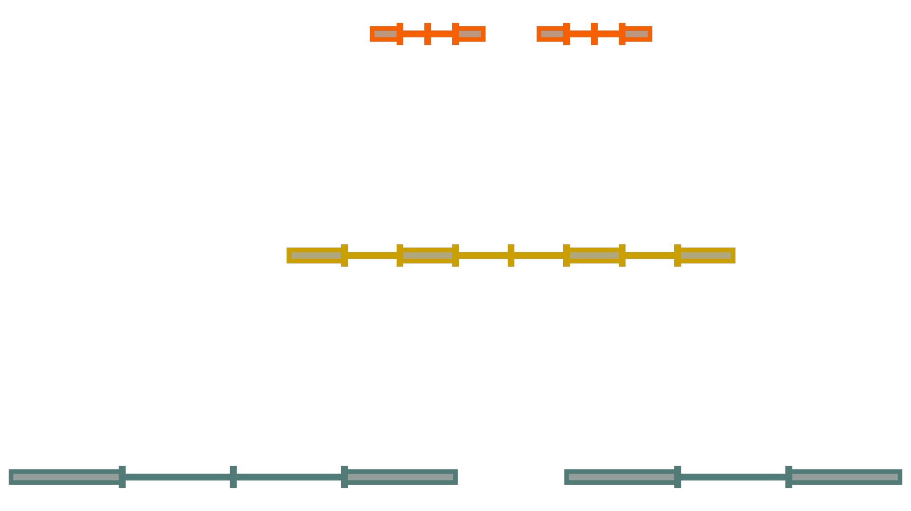<span>\\</span>
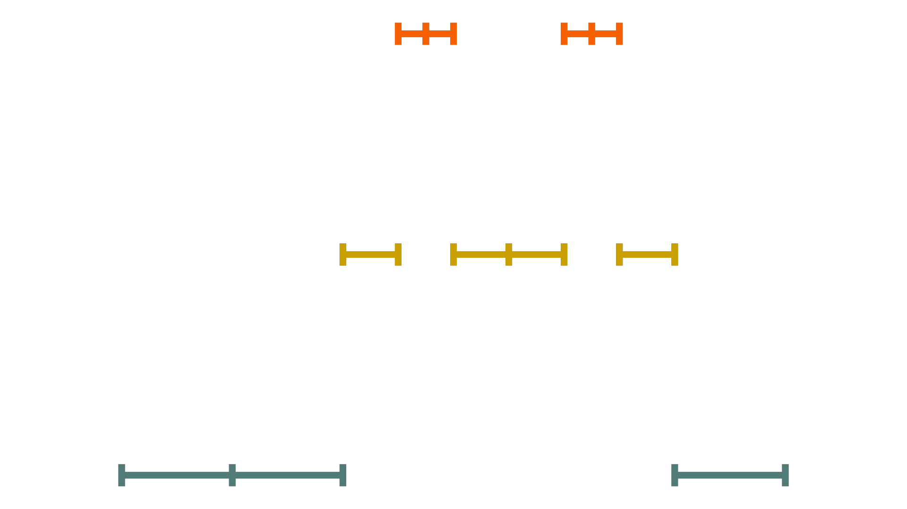

<span>=</span>

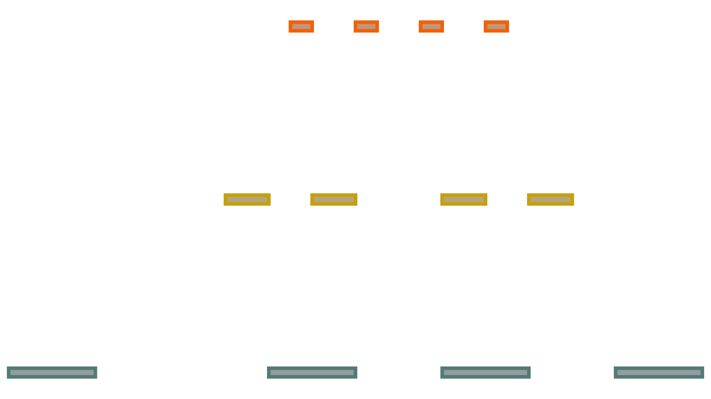
:::

## Algebra of sets

The search of an admissible set is recursive. The algorithm starts from the last dimension (y in 2d, z in 3d,...).

:::{.my-3}
The available operators in samurai are for now
:::

:::{.lh-lg}
- the <span>intersection</span> of sets,
- the <span>union</span> of sets,
- the <span>difference</span> between two sets,
- the <span>translation</span> of a set,
- the <span>projection</span> of a set.
:::

:::{.notes}
The search for an admissible set is completely recursive. We'll start by searching in the largest dimension and if we don't find anything we'll stop.

If an admissible interval is found, we look at it in the lower dimension, which means we manipulate very few intervals because we're only looking at a subset.
:::

## Usage example: find jumps

::::{.center-page}
:::{.row}
::::{.col-6}
```{=html}
<video data-autoplay loop src="videos/jump.mp4" />
```
::::

::::{.col-6 .align-self-center}
```{.cpp}
auto jump_set = intersection(
                    translate(mesh[1], {1}).on(0),
                    mesh[0]
                );
```
::::
:::
::::

## Usage example: the projection operator

::::{.center-page}
:::{.row}
::::{.col-6}
```{=html}
<video data-autoplay src="videos/projection.mp4" />
```
::::

::::{.col-6 .fragment .align-self-center}
```{.cpp}
auto proj_set = intersection(mesh[level], mesh[level + 1])
          .on(level);

proj_set([&](auto i)
{
    u(level, i) = 0.5*(u(level+1, 2*i) + u(level+1, 2*i+1));
});
```
::::
:::
::::

## Compression rates

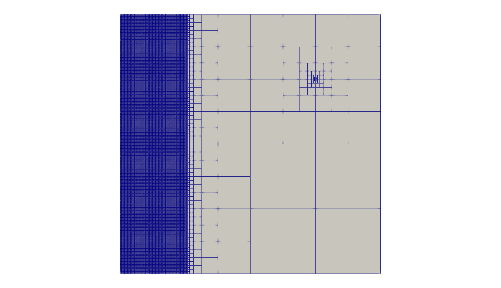

## Compression rates

::: {.center-page .fs-5}
| Level | Num. of cells | p4est       | samurai (leaves) | samurai (all) | ratio  |
|-------|---------------|-------------|------------------|---------------|--------|
| $9$   | 66379         | 2.57 Mb     | 33.68 Kb         | 121 Kb        | 21.24  |
| $10$  | 263767        | 10.25 Mb    | 66.64 Kb         | 236.8 Kb      | 43.28  |
| $11$  | 1051747       | 40.96 Mb    | 132.36 Kb        | 467.24 Kb     | 87.66  |
| $12$  | 4200559       | 163.75 Mb   | 263.6 Kb         | 927 Kb        | 176.64 |
| $13$  | 16789627      | 654.86 Mb   | 525.9 Kb         | 1.85 Mb       | 353.98 |
| $14$  | 67133575      | 2.61 Gb     | 1.05 Mb          | 3.68 Mb       | 709.24 |
:::

:::{.notes}
We can see here that the mesh is very compressed compared to a version using a tree structure.

The total size of the mesh is multiplied by just under 4, as we build different meshes to handle ghost cells and prediction cells.

What's important to note is that in a parallel context, it doesn't cost much for each process to have the meshes of its neighboring domains.
:::

## Other features

:::{.center-page-vertically .lh-lg}
- Loop algorithms over the levels and the cells
- Simplified access operator
- Reconstruct a value anywhere even if the cell doesn't exist
- Helper classes to construct complex meshes
- Helper classes to construct schemes for explicit and implicit usage
- Helper classes to construct N-D operators and expressions using xtensor or Eigen
- MPI support
- HDF5 support
:::

## Roadmap

:::{.text-center}
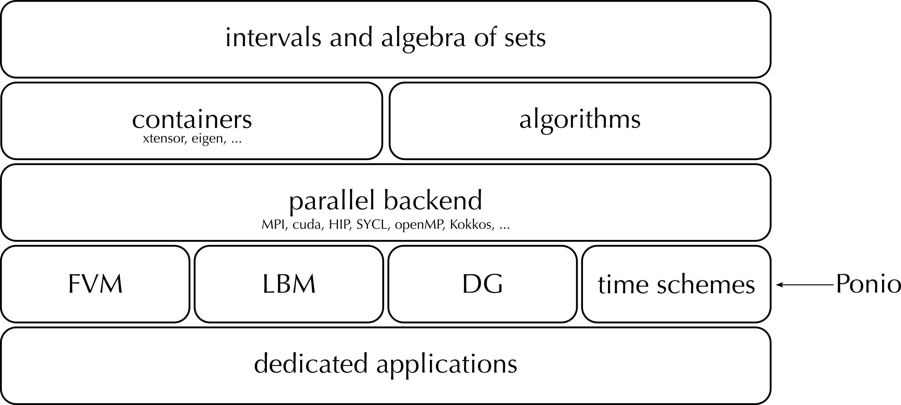
:::

:::{.notes}
Here's the samurai roadmap for the coming months and probably years.

We now have the possibility of changing the containers in which our fields are stored. We did this so that we could start using Kokkos. So we'd be very interested in working with the people at Cexa on this.

We have received several funding packages that have enabled us to hire two research engineers.

As part of numpex, we also have an engineer position to work on the I/O part of AMR methods in collaboration with Dyablo developers.
:::

---

:::::{.center-page}
::::{.columns}
:::{.column width="50%"}
### People involved
- 4 core developers
- users and developers communities
- Various collaborations and research programs

:::{.row .text-center .align-items-center}
::::{.col}
{height="110px"}
::::
::::{.col}
{height="100px"}
::::
:::
:::{.row .text-center .align-items-center}
::::{.col}
{height="50px"}
::::
::::{.col}
{height="80px"}
::::
:::
:::{.row .text-center .align-items-center}
::::{.col}
{height="40px"}
::::
::::{.col}
{height="95px"}
::::
:::
:::
:::{.column width="50%"}
### Real-World Applications
- Interfacial flow simulation
- Simulation analysis on the Hydrogen risk
- Plasma dynamics
- Battery simulation
- Combustion modeling
:::
::::
:::::
---

:::::{.center-page}
:::{.row .align-items-center}
::::{.col-4}
<video data-autoplay loop="true" src="videos/ink.mp4" />
::::
::::{.col}
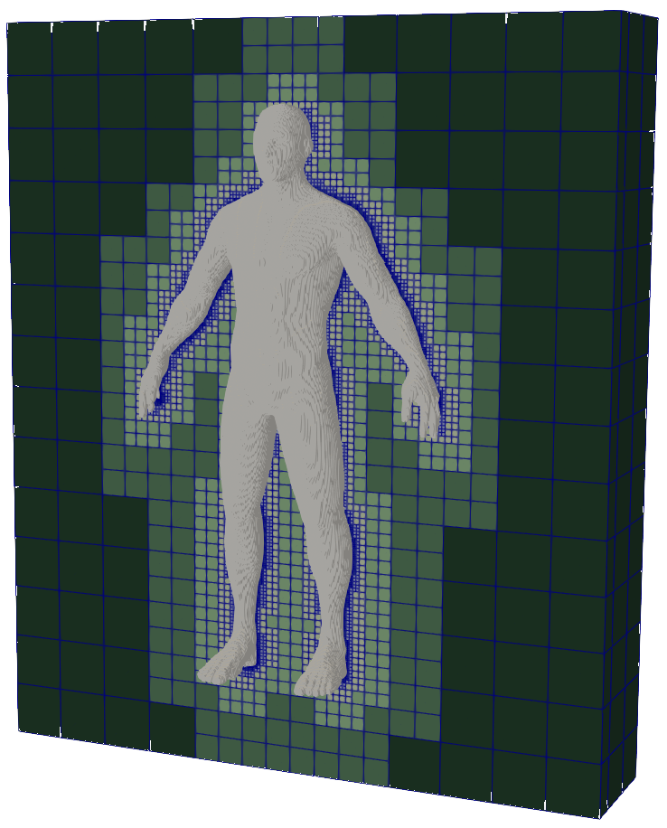
::::
::::{.col-5}
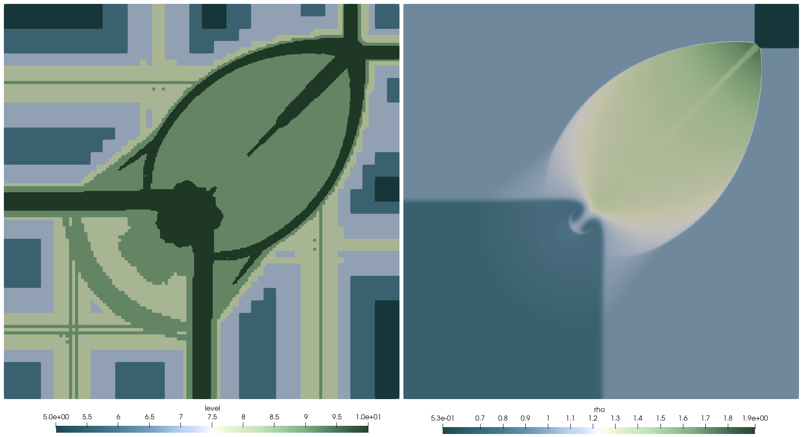
::::
:::

:::{.row .align-items-center}
::::{.col-4}
<video data-autoplay loop="true" src="videos/bubble.mp4" />::::
::::{.col}
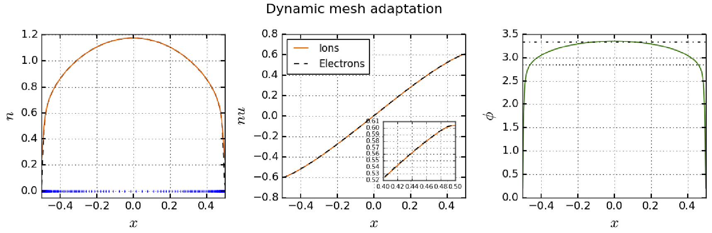
::::
:::
:::::

---

:::{.center-page}
::::{.row}
:::::{.col-6}

::::::
::::::{.col-6 .align-self-center .text-end}
:::{.h1 .title-talk}
Samurai
:::
[https://github.com/hpc-maths/samurai](https://github.com/hpc-maths/samurai)
::::::
::::
:::

<!-- ## Scientific Collaborations


- Lattice Boltzmann methods and multiresolution - **Thomas Bellotti** (*EM2C/CNRS/CS*) and **Benjamin Graille** (*LMO/Université Paris-Saclay*)
- Plasma discharges and electric propulsion - **Alejandro Alvarez** (*LPP/École polytechnique*) and **Louis Reboul** (*ONERA*)
- DNS of lithium-ion batteries based on high-resolution 3D images of porous electrode microstructures - **Ali Asad** (*TotalEnergies*) and **Laurent François** (*ONERA*)
- Sharp interface method for low Mach two-phase flows - **Nicolas Grenier** (*LISN/Université Paris-Saclay*) and **Christian Tenaud** (*EM2C/CNRS/CS*)
- Low-Mach reactive flows - **Christian Tenaud** (*EM2C/CNRS/CS*)
- Interfacial flow simulation - **Giuseppe Orlando** and **Ward Haegeman** (*CMAP/Ecole polytechnique*), **Samuel Kokh** (*CEA/MdlS*), **Joël Dupays** and **Clément Le Touze** (*ONERA*), **Marica Pelanti** (*ENSTA/IP Paris*), **Khaled Saleh** (*Aix-Marseille Université*), **Jean-Marc Hérard** (*EDF*)
- Mathematical modeling and simulation of non-equilibrium plasmas for the prediction of electric propulsion - **Teddy Pichard** and **Zoubaïr Tazakkati** (*CMAP/École polytechnique*)
- Simulation analysis on the Hydrogen risk - **Luc Lecointre**, **Pierre-Alexandre Masset**, **Etienne Studer** (*CEA*) and **Christian Tenaud** (*EM2C/CNRS/CS*) -->


<!--  -->
